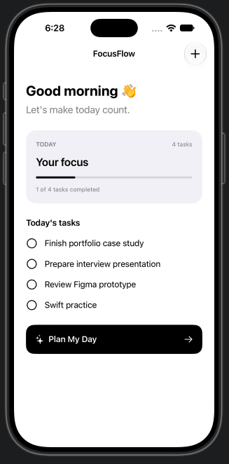
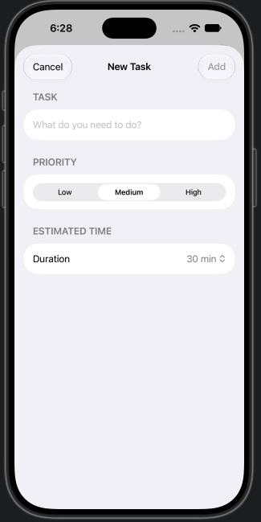
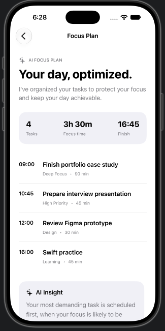

# ✨ AI Product Design Lab

A collection of small experiments exploring the intersection of **Product Design, AI, and code**.

## FocusFlow

**FocusFlow** is a native iOS productivity concept built with SwiftUI that explores how AI could transform an unstructured task list into a focused, achievable daily plan.

### The idea

Instead of simply managing a to-do list, FocusFlow organizes tasks into an optimized daily schedule based on priority, estimated effort, and focus time.

### Features

- Create daily tasks
- Set priority and estimated duration
- AI-style daily planning experience
- Optimized focus schedule
- Daily productivity insights
- Native SwiftUI interface

## 📱 Product Preview

  
  
  

## 🛠 Built With

- Swift
- SwiftUI
- Xcode
- Figma
- AI-assisted development

## 🎯 Why I Built This

As a Senior Product Designer, I'm exploring how designers can move beyond static prototypes and turn product ideas into functional experiences.

FocusFlow is a small experiment in translating **product thinking, interaction design, and UI decisions directly into native SwiftUI code**.

## 👩‍💻 About Me

I'm **Amira Elbana**, a Senior Product Designer based in Dubai with 7+ years of experience across fintech, travel, enterprise, and AI products.

My work combines **UX strategy, product design, prototyping, and AI-assisted development**.
